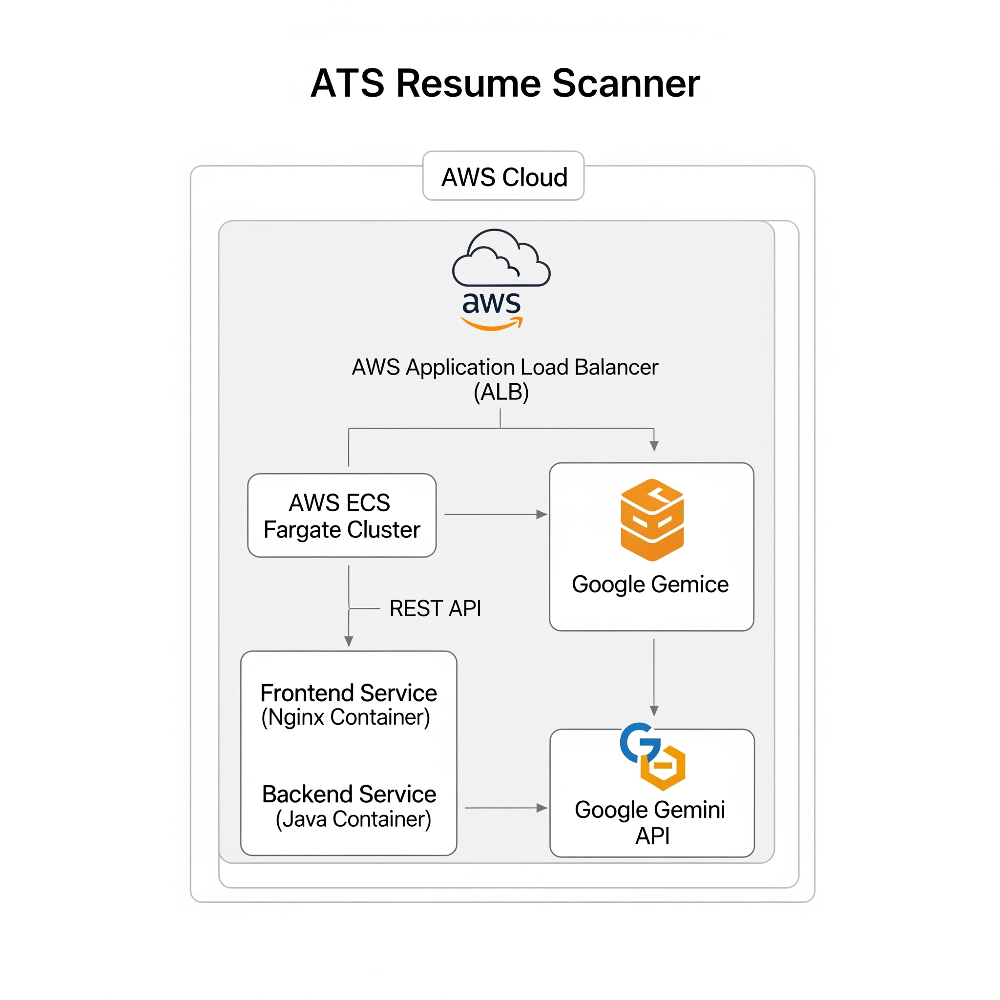

# ATS Resume Scanner

An intelligent tool designed to help job seekers optimize their resumes for Applicant Tracking Systems (ATS). This application analyzes a resume against a job description, provides a match score, and offers AI-powered suggestions for improvement using the Google Gemini API.

## Architectural Diagram

The following diagram illustrates the end-to-end architecture of the ATS Resume Scanner application, from the user interface to the cloud deployment.



## Key Features

* **Resume vs. Job Description Analysis**: Compares your resume against a job description to identify keyword and skill alignment.
* **AI-Powered Scoring**: Generates a percentage score representing how well your resume matches the job requirements.
* **Keyword Analysis**: Highlights matching keywords found in the resume and identifies important missing terms from the job description.
* **Actionable Suggestions**: Provides AI-generated recommendations to improve your resume for the specific job you are applying for.
* **Modern, User-Friendly Interface**: A clean and intuitive UI built with React for a seamless user experience.

## Tech Stack

### Frontend

* **React**: A JavaScript library for building user interfaces. 
* **Vite**: A fast and modern build tool for web development. 
* **Tailwind CSS**: A utility-first CSS framework for rapid UI development.
* **Axios**: A promise-based HTTP client for making API requests to the backend.

### Backend

* **Java & Spring Boot**: A robust framework for building the REST API. 
* **Apache PDFBox**: A Java library used for parsing text content from PDF documents. 
* **Google Gemini API**: The core AI service for performing the resume analysis. 

### Infrastructure & Deployment

* **Docker & Docker Compose**: For containerizing the application and enabling easy local development setup. 
* **AWS (Amazon Web Services)**: The cloud platform for hosting the application.
    * **ECS Fargate**: For running the containerized services without managing servers. [
    * **Application Load Balancer (ALB)**: To distribute incoming traffic between the frontend and backend services. 
    * **VPC, Subnets, etc.**: The underlying network infrastructure. 
* **Terraform**: For defining and managing the entire cloud infrastructure as code (IaC). 
* **GitHub Actions**: For automating the Continuous Integration and Continuous Deployment (CI/CD) pipeline. 
* **GitHub Container Registry**: For storing the versioned Docker images.

## Getting Started

To run this project locally, you'll need Docker and Docker Compose installed.

1.  **Clone the repository:**
    ```bash
    git clone https://github.com/kotturi-mahipal/ats-resume-scanner.git
    cd ats-resume-scanner
    ```
2.  **Set up your environment variables:**
    Create a `.env` file in the root of the project and add your Google Gemini API key:
    ```
    GEMINI_API_KEY=YOUR_GEMINI_API_KEY
    ```
3.  **Run the application:**
    ```bash
    docker-compose up --build
    ```
4.  **Access the application:**
    * **Frontend**: `http://localhost:8081`
    * **Backend API**: `http://localhost:8080`

## My Learnings and Challenges

This project was a fantastic learning experience that spanned the full software development lifecycle, from coding to cloud deployment.

### Learnings

* **Full-Stack Development**: I gained valuable hands-on experience in building a complete web application, integrating a modern React frontend with a robust Spring Boot backend.
* **Infrastructure as Code (IaC)**: Using Terraform to define the entire cloud infrastructure was a game-changer. It allowed me to create a reproducible, version-controlled, and easily manageable environment on AWS.
* **CI/CD Automation**: Implementing a full CI/CD pipeline with GitHub Actions was a major highlight. Automating the build, testing, and deployment process not only saved a significant amount of manual effort but also ensured a more reliable and consistent release process.
* **Working with Large Language Models (LLMs)**: Integrating with the Google Gemini API was my first time working directly with a large language model. It was fascinating to see how a well-crafted prompt could produce such detailed and structured JSON output, which formed the core of the application's intelligence.

### Challenges

* **CORS Issues**: Like many full-stack projects, I initially ran into Cross-Origin Resource Sharing (CORS) problems between my frontend (running on one port) and backend (on another). I learned how to properly implement a global CORS configuration in Spring Boot to securely allow requests from my frontend's origin.
* **Terraform State Management**: Understanding how Terraform manages infrastructure state was a learning curve. I learned the importance of using a remote backend (in this case, an S3 bucket and DynamoDB table for locking) to securely store the state, prevent conflicts, and enable collaboration. 
* **IAM Permissions**: Getting the IAM roles and permissions right for the GitHub Actions pipeline to access AWS resources was tricky. It required a good understanding of AWS's security model to grant the necessary `id-token: write` permissions for OIDC authentication without being overly permissive.
* **Prompt Engineering**: Crafting the perfect prompt for the Gemini API took several iterations. I had to be very specific in my instructions to ensure that the API consistently returned the desired JSON structure with the right level of detail, which was crucial for parsing the response on the backend. 

## Future Improvements

* **User Authentication**: Add user accounts to allow users to save and track their resume analysis history over time.
* **More Detailed Analysis**: Expand the analysis to include feedback on resume formatting, use of action verbs, and other job-seeking best practices.
* **Support for More File Types**: Add support for other common resume formats like `.docx` and `.txt` by integrating additional parsing libraries.
* **Enhanced UI/UX**: Improve the user interface with more interactive visualizations, such as highlighting keywords directly on a rendered version of the resume.

## License

This project is licensed under the MIT License. See the `LICENSE` file for more details.